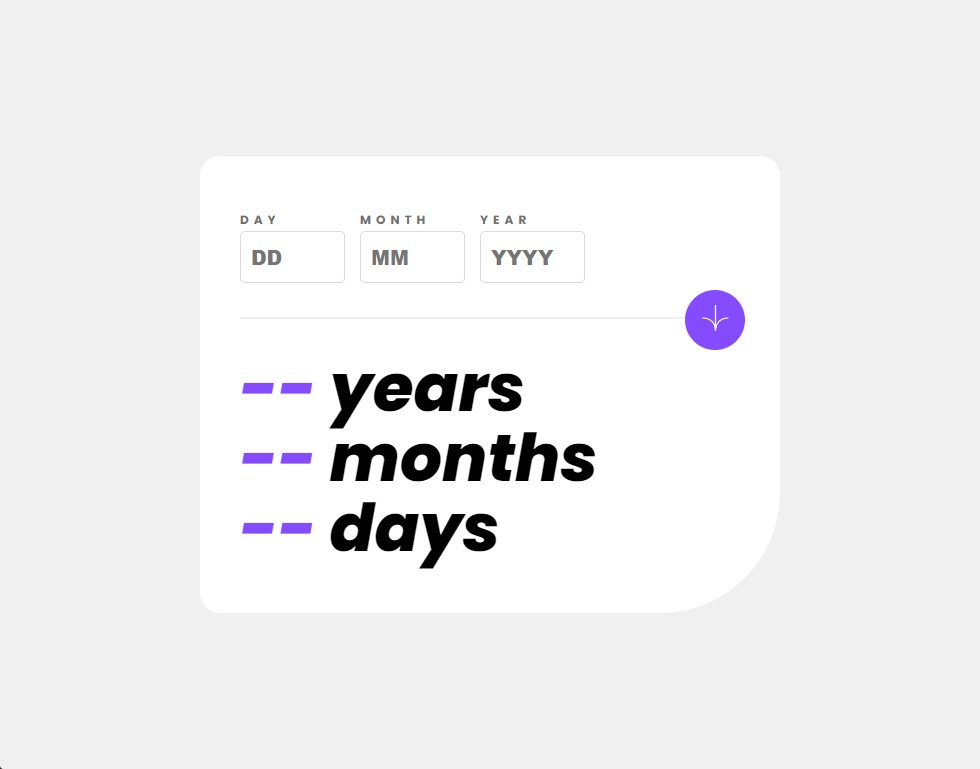

# Frontend Mentor - Age calculator app solution

This is a solution to the [Age calculator app challenge on Frontend Mentor](https://www.frontendmentor.io/challenges/age-calculator-app-dF9DFFpj-Q). Frontend Mentor challenges help you improve your coding skills by building realistic projects. 

## Table of contents

- [Overview](#overview)
  - [The challenge](#the-challenge)
  - [Screenshot](#screenshot)
  - [Links](#links)
- [My process](#my-process)
  - [Built with](#built-with)
  - [What I learned](#what-i-learned)
  - [Continued development](#continued-development)
  - [Useful resources](#useful-resources)
- [Author](#author)

## Overview

### The challenge

Users should be able to:

- View an age in years, months, and days after submitting a valid date through the form
- Receive validation errors if:
  - Any field is empty when the form is submitted
  - The day number is not between 1-31
  - The month number is not between 1-12
  - The year is in the future
  - The date is invalid e.g. 31/04/1991 (there are 30 days in April)
- View the optimal layout for the interface depending on their device's screen size
- See hover and focus states for all interactive elements on the page

### Screenshot

### Links

- [Live Site URL](https://kamillazarczyk1.github.io/age-calc-app/)

## My process

### Built with

- Semantic HTML5 markup
- Sass
- Flexbox
- Mobile-first workflow
- [React](https://reactjs.org/) - JS library
- Luxon.js

### What I learned

By doing this challange I got to know React more and I experienced working with Luxon.js - a JavaScript library that simplifies dealing with dates and times in JavaScript.

### Continued development

I need to improve the cleanliness of my code and learn React more.

### Useful resources

- [Stack Overflow](https://stackoverflow.com/)
- [W3Schools](https://www.w3schools.com/)

## Author

- Frontend Mentor - [@KamilLazarczyk1](https://www.frontendmentor.io/profile/KamilLazarczyk1)